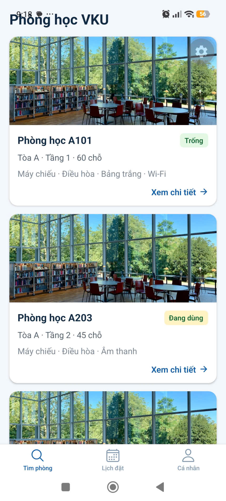
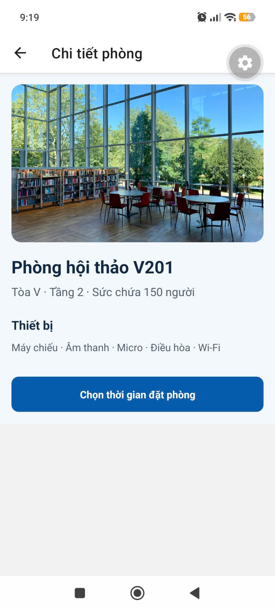
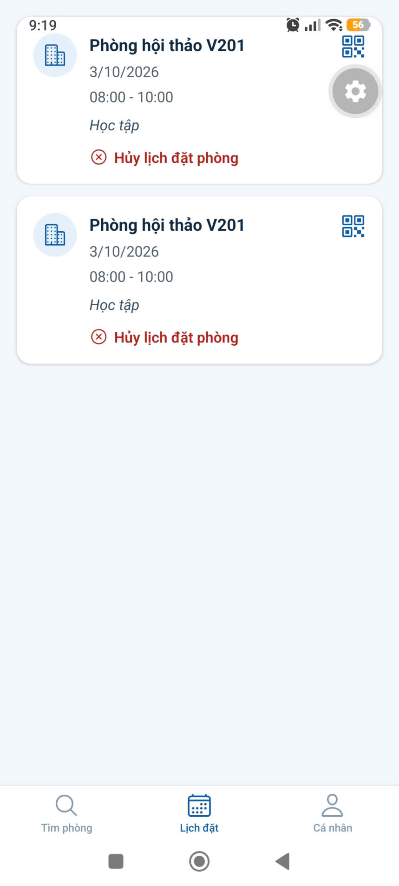

# MINI-PROJECT SHORT TECHNICAL REPORT

**Course:** Cross-Platform Mobile App Development (VKU)  
**Mini-Project Title:** Mini-Project: VKURoomBooking - App Đặt Phòng Học Trực Tuyến  
**Team / Student Name:** Dư Thị Như Yến  
**Submission Date:** 24/09/2026

---

## 1. GENERAL INFORMATION & DELIVERABLE LINKS

- **Team Members:**
  1. Dư Thị Như Yến — Student ID: 23IT328 — Role: Full-stack Hybrid Mobile Developer — Contribution: 100%
- **🔗 Live Demo URL:** https://mini-project-1-vku-field-survey-pwa.pages.dev
- **💻 GitHub Repository:** https://github.com/NhuYen-jpg/Capacitator---View-Survey
- **🎥 Video Demo (Optional):** N/A

---

## 2. FEATURE IMPLEMENTATION CHECKLIST

| No. | Feature                              | Status   | Description                                                                                                              |
| --: | ------------------------------------ | -------- | ------------------------------------------------------------------------------------------------------------------------ |
|   1 | React Native / Expo Mobile App       | Complete | Xây dựng giao diện tìm kiếm, lọc phòng học theo khu/tầng và đặt phòng responsive trên nhiều nền tảng.                    |
|   2 | Global State Management with Zustand | Complete | Quản lý trạng thái phiếu đặt phòng, danh sách lịch sử đặt phòng và bộ lọc tìm kiếm realtime.                             |
|   3 | Server State with TanStack Query     | Complete | Mô phỏng Fetch API lấy dữ liệu danh sách phòng học từ `MOCK_ROOMS`, hỗ trợ trạng thái `isLoading`, `error` và `refetch`. |
|   4 | Native QR Code Generation & Passcode | Complete | Tự động tạo mã QR xác thực cho từng phiếu đặt phòng thành công để sinh viên quét khi vào cửa.                            |

## 3. TECHNICAL ARCHITECTURE & PROJECT STRUCTURE

### 3.1 Directory Structure

```text
VKURoomBooking/
├── App.tsx
├── src/
│   ├── data/
│   │   └── rooms.ts
│   ├── navigation/
│   │   └── RootNavigator.tsx
│   ├── screens/
│   │   ├── BrowseRoomsScreen.tsx
│   │   ├── RoomDetailsScreen.tsx
│   │   ├── BookingFormScreen.tsx
│   │   ├── BookingConfirmationScreen.tsx
│   │   ├── MyBookingsScreen.tsx
│   │   └── ProfileScreen.tsx
│   ├── store/
│   │   └── useBookingStore.ts
│   └── types/
│       └── index.ts
├── assets/
├── app.json
└── package.json
```

### 3.2 State Management & Flow

1. **Chọn phòng:** Sinh viên duyệt danh sách phòng, tìm kiếm hoặc lọc theo khu/tầng trên `BrowseRoomsScreen`.
2. **Lấy dữ liệu:** Danh sách phòng được cung cấp từ `MOCK_ROOMS`; TanStack Query đảm nhiệm server state và các trạng thái tải dữ liệu, lỗi, làm mới.
3. **Điền biểu mẫu:** Sinh viên chọn phòng và nhập thông tin đặt phòng trên `BookingFormScreen`.
4. **Lưu trạng thái:** Khi xác nhận, thông tin phiếu đặt phòng được thêm vào Zustand store; lịch sử được lưu bằng AsyncStorage.
5. **Xác nhận:** `BookingConfirmationScreen` hiển thị thông tin phiếu và mã QR được tạo từ mã định danh booking.

```text
Browse / Filter Rooms -> Select Room -> Booking Form
    -> Zustand: Save Booking -> Confirmation Screen -> Render QR Code
```

## 4. EMPIRICAL EVIDENCE & SCREENSHOTS

### Screenshot 1: Màn hình Danh sách phòng & Bộ lọc (`BrowseRoomsScreen`)

> 
> _Mô tả:_ ảnh danh sách phòng và bộ lọc theo khu/tầng.

### Screenshot 2: Màn hình Chi tiết phòng & Form đặt phòng (`BookingFormScreen`)

> 
> _Mô tả:_ ảnh chi tiết phòng và biểu mẫu đặt phòng.

### Screenshot 3: Màn hình Mã QR Xác nhận đặt phòng (`BookingConfirmationScreen`)

> 
> _Mô tả:_ ảnh xác nhận đặt phòng có mã QR.

### Screenshot 4: Màn hình Lịch sử đặt phòng của tôi (`MyBookingsScreen`)

> 
> _Mô tả:_ ảnh danh sách lịch sử đặt phòng.

## 5. TECHNICAL CHALLENGES & RESOLUTIONS

### Bottleneck 1: Xung đột phiên bản Expo SDK và Expo Go

**Error:** `[runtime not ready]: TypeError: Cannot assign to property 'protocol'`.

- **Thách thức:** Phiên bản Expo Go trên thiết bị Android cập nhật SDK mới, gây runtime mismatch với `expo-constants`.
- **Giải pháp:** Xóa cache/data của ứng dụng Expo Go, đồng bộ phiên bản thư viện bằng `npx expo install --fix`, sau đó cấu hình EAS Build để tạo APK độc lập.

### Bottleneck 2: Flexbox và Safe Area trên Android và Web

- **Thách thức:** Wrapper thiếu `flex: 1` và `height: 100%` làm nội dung co rút khi chạy cross-platform.
- **Giải pháp:** Bọc ứng dụng bằng `SafeAreaProvider` và đặt nội dung trong `View` có `flex: 1`, `width: '100%'` và `height: '100%'` trong `App.tsx`.

---

**Implementation note:** TanStack Query client/provider đã được cấu hình trong ứng dụng, nhưng `BrowseRoomsScreen` hiện đang lọc trực tiếp `MOCK_ROOMS`; màn hình này chưa sử dụng `useQuery` hoặc `refetch`. Cần tích hợp luồng query trước khi mô tả các trạng thái đó như hành vi đã chạy thực tế.
